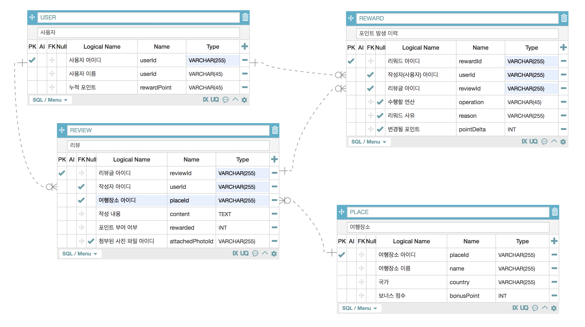

## 클럽 마일리지 서비스

> 포인트 적립 / 포인트 조회 REST API

<br/>

### API 데모

<!-- [](https://www.youtube.com/watch?v=7iE5rkEBu9Y?t=0s) -->

[동일한 기능의 Node.js / Express 버전 바로가기 >>>>>](https://github.com/portfolio-y0711/reward_backend)

[동일한 기능의 Java / Spring boot 버전 바로가기 >>>>>](https://github.com/portfolio-y0711/reward_springboot)

<br/>

**목차**

프로그램 작동법

구현 내용 (coverage of implementation)

데이터베이스 스키마 (database scheme)

설계상 주안점(design focus)

<br/>

### 1. 프로그램 작동법

<!--

<br/>

🚀 &nbsp; **_macOS_** :

_$ git clone https://github.com/portfolio-y0711/reward_springboot_

_$ cd reward_springboot_

_$ mvn package_

_$ java -jar demo-0.0.1-SNAPSHOT.jar --server.port=8080_

<br/>

☔ ️&nbsp; **_테스트 코드 실행_** :

- 유닛 테스트 / 통합 테스트 / 시나리오 테스트: $ mvn test

<br/>

-->

### 2. 구현 내용

<br/>

💻 &nbsp; **사용한 주요 언어 및 기술** :

- kotlin 1.3.72 (compiler) Java 1.8 (runtime)
- Spring Web (server application)
- Spring Data JPA (database adaptor)
- Spring QueryDSL (domain Specific language for JPQL)
- Cucumber (test specification tools)
- Mockk (mocking tools)
- Logback (as application logger)
- H2 (database)
- Swagger (openAPI documentation tools)

💻 &nbsp; **구현한 기능** :

- /events 리뷰 추가|변경|삭제 이벤트 처리 엔드포인트

  - 트랜잭션 처리

  - Context Error / Validation Error 처리 (리뷰 중복)

  - HTTP Request 로그 + Application 로그

- /users/{userId}/rewardPoint 사용자의 현재 포인트 총계

- /users/{userId}/rewards 사용자의 포인트 누적 이력

<br/>

-->

### 3. 데이터베이스 스키마

<br/>



<!--
<br/>

🏗 &nbsp; **_DDL Script_** :

```sql
# PLACES(장소)

CREATE TABLE IF NOT EXISTS

    PLACES (
      placeId VARCHAR PRIMARY KEY,
      country VARCHAR NOT NULL,
      name VARCHAR NOT NULL,
      bonusPoint INTEGER NOT NULL,
      timestamp DATETIME DEFAULT CURRENT_TIMESTAMP NOT NULL

) WITHOUT ROWID;

CREATE INDEX IF NOT EXISTS index_places_country ON PLACES(country);
CREATE INDEX IF NOT EXISTS index_places_name ON PLACES(name);
CREATE INDEX IF NOT EXISTS index_places_country_name ON PLACES(country,name);

# USERS(사용자)

CREATE TABLE IF NOT EXISTS

    USERS (
      userId VARCHAR PRIMARY KEY,
      name VARCHAR NOT NULL,
      rewardPoint INTEGER NOT NULL,
      timestamp DATETIME DEFAULT CURRENT_TIMESTAMP NOT NULL
    ) WITHOUT ROWID;

CREATE INDEX IF NOT EXISTS index_users_name ON users(name);

# REVIEWS(사용자 작성 리뷰)

CREATE TABLE IF NOT EXISTS

    REVIEWS (
      reviewId VARCHAR PRIMARY KEY,
      placeId INTEGER,
      content VARCHAR NOT NULL,
      attachedPhotoIds VARCHAR NOT NULL,
      userId INTEGER,
      rewarded INTEGER NOT NULL,
      timestamp DATETIME DEFAULT CURRENT_TIMESTAMP NOT NULL,

      CONSTRAINT fk_places
      FOREIGN KEY (placeId)
      REFERENCES PLACES (id)

      CONSTRAINT fk_users
      FOREIGN KEY (userId)
      REFERENCES USERS (id)
    ) WITHOUT ROWID;

CREATE INDEX IF NOT EXISTS index_reviews_rewarded ON REVIEWS(rewarded);

# REWARDS(포인트 적립 기록)

CREATE TABLE IF NOT EXISTS

    REWARDS (
      rewardId VARCHAR PRIMARY KEY,
      userId VARCHAR,
      reviewId VARCHAR,
      operation VARCHAR NOT NULL,
      pointDelta INTEGER NOT NULL,
      reason VARCHAR NOT NULL,
      timestamp DATETIME DEFAULT CURRENT_TIMESTAMP NOT NULL,

      CONSTRAINT fk_users_rewards_users
      FOREIGN KEY (userId)
      REFERENCES USERS (id)

    ) WITHOUT ROWID;

CREATE INDEX IF NOT EXISTS index_rewards_reason ON REWARDS(reason);
```
-->

### 4. 설계상 주안점, 워크플로우

<!--

<br/>

🎯 &nbsp; **_Open Closed Principle_** : 이벤트 타입, 액션에 따른 전략 객체 생성을 통한 이벤트 처리 알고리즘 변경 / 이벤트 라우터 (Event Router / Action Router) 주입으로 유연한 설계 구현

<br/>

**_⌘ 관련 코드_**

_이벤트 핸들링 서비스_: [`src/main/java/com/portfolioy0711/api/services`](https://github.com/portfolio-y0711/reward_springboot/tree/main/src/main/java/com/portfolioy0711/api/services)

```ts
// 이벤트 타입("REVIEW") 액션 타입("ADD", "MOD", "DELETE")
// 이벤트 타입("BLAR_BLAR") 액션 타입("A", "B", "C")

@RestController
@Api(tags = "Event")
public class EventController {
    private EventService eventService;

    public EventController(EventService eventService, EventDatabase eventDatabase) {
        this.eventService = eventService;

        EventRouter reviewEventRouter = new ReviewEventActionRouter()
            .addRoute("ADD", new AddReviewActionHandler(eventDatabase))
            .addRoute("MOD", new ModReviewActionHandler(eventDatabase))
            .addRoute("DELETE", new DelReviewActionHandler(eventDatabase));

        EventRouter blarblarEventRouter = new BlarBlarEventActionRouter()
            .addRoute("A", new A_ActionHandler(eventDatabase))
            .addRoute("B", new B_ActionHandler(eventDatabase))
            .addRoute("C", new C_ActionHandler(eventDatabase));

        this.eventService
                .addEventRouter("REVIEW", reviewEventRouter)
                .addEventRouter("BLAR_BLAR", blarblarEventRouter);
    }

    @RequestMapping(value = "/events", method = POST)
    public void postEvent(@RequestBody Object body) throws ParseException, JsonProcessingException {
        EventMapper eventValidator = new EventMapper(body);
        eventValidator.validate("type", EventTypeEnum.getEventTypes());
        this.eventService.route(body);
    }
}

```

<br/>

<br/>

🎯 &nbsp; **_BDD / TDD driven_** : 유닛 테스트 코드로 scaffolding 한 이후, 통합 테스트와 함께 구현체를 작성해 나가는 테스트 주도 개발 워크플로우 사용

<br/>

**_⌘ 관련 코드_**

_유닛 테스트_: [`src/test/java/com/portfolioy0711.api/_unit`](https://github.com/portfolio-y0711/reward_springboot/tree/main/src/test/java/com/portfolioy0711/api/_unit)

_통합 테스트_: [`src/test/java/com/portfolioy0711.api/_i11`](https://github.com/portfolio-y0711/reward_springboot/tree/main/src/test/java/com/portfolioy0711/api/_i11)

_시나리오 테스트_: [`src/test/java/com/portfolioy0711.api/_usecase`](https://github.com/portfolio-y0711/reward_springboot/tree/main/src/test/java/com/portfolioy0711/api/_usecase)

<br/>

```Cucumber

# src/test/resources/features/scenarios.add.feature

Feature: 리뷰 이벤트 처리 [REVIEW, ADD]

Background: 리뷰 이벤트 처리를 위해서는 특정 장소와 유저가 존재해야 함
    Given 아래와 같이 특정 장소가 등록되어 있음_1
        | placeId                              | country | name | bonusPoint |
        | 2e4baf1c-5acb-4efb-a1af-eddada31b00f | 호주     | 멜번  | 1          |

    And 아래와 같이 특정 유저가 등록되어 있음_1
        | userId                               | name     | rewardPoint |
        | 3ede0ef2-92b7-4817-a5f3-0c575361f745 | Michael  | 0           |

Rule: 유저가 작성한 글이 특정 장소에 대한 첫번째 리뷰글이면 유저에게 포인트가 부여됨

    Scenario: 사용자가 리뷰를 새로 작성함

        Given 아래 장소에 대한 리뷰글이 존재하지 않음_1
            | placeId                              |
            | 2e4baf1c-5acb-4efb-a1af-eddada31b00f |

        When 유저가 아래와 같이 리뷰글을 작성함_1
            | type   | action | reviewId                              | content | attachedPhotoIds                                                                | userId                               | placeId                              |
            | REVIEW | ADD    | 240a0658-dc5f-4878-9831-ebb7b26687772 | 좋아요    | e4d1a64e-a531-46de-88d0-ff0ed70c-c0bb8,afb0cef2-851d-4a50-bb07-9cc15cbdc332     | 3ede0ef2-92b7-4817-a5f3-0c575361f745 |  2e4baf1c-5acb-4efb-a1af-eddada31b00f|

        Then 유저의 리워드 레코드가 아래와 같이 생성됨_1
            | userId                               | reviewId                              | operation | pointDelta | reason |
            | 3ede0ef2-92b7-4817-a5f3-0c575361f745 | 240a0658-dc5f-4878-9831-ebb7b26687772 | ADD       | 3          | NEW    |

        And 유저의 포인트 총점이 아래와 같아짐_1
            | userId                                | rewardPoint |
            | 3ede0ef2-92b7-4817-a5f3-0c575361f745  | 3           |

        And 유저의 리뷰 레코드가 아래와 같이 생성됨_1
            | reviewId                               | placeId                               | content | attachedPhotoIds                                                           | userId                                | rewarded |
            | 240a0658-dc5f-4878-9831-ebb7b26687772  | 2e4baf1c-5acb-4efb-a1af-eddada31b00f  | 좋아요    | e4d1a64e-a531-46de-88d0-ff0ed70c0bb8,afb0cef2-851d-4a50-bb07-9cc15cbdc332  | 3ede0ef2-92b7-4817-a5f3-0c575361f745  | 1        |

```
-->
